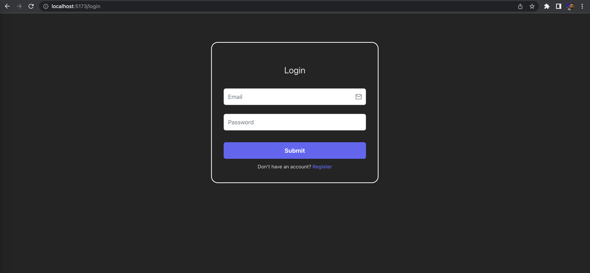
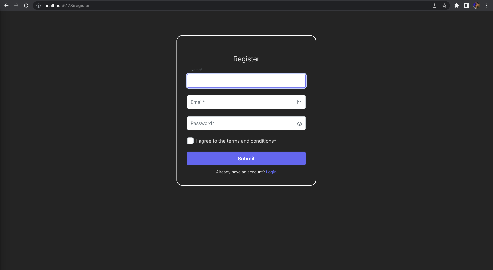
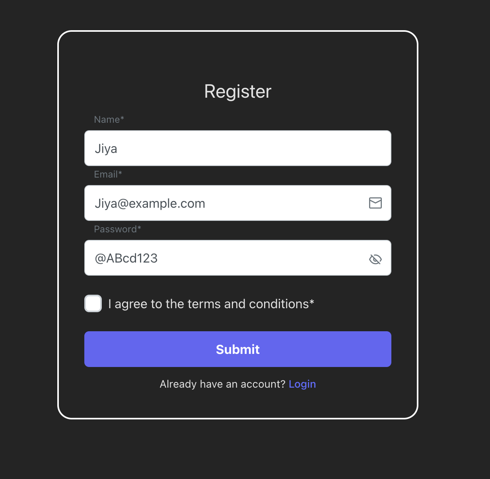
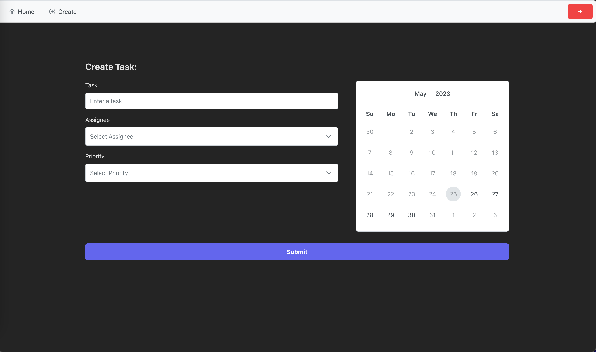
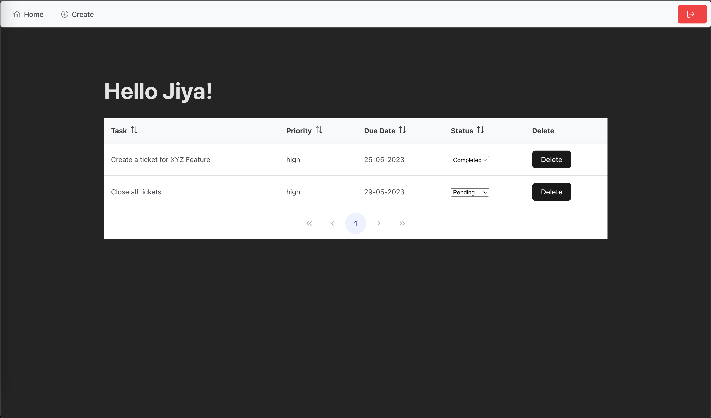

### PowerCred Assignment [Full Stack]
---
<!-- Table -->
**Description:**
The objective of this assignment is to demonstrate my proficiency as a full-stack developer with expertise in using FastAPI for the backend and React for the frontend. I am required to build a more advanced application that allows users to manage a list of tasks with additional features.

### Steps to run Frontend
- `git clone https://github.com/Jiya-Ull-Haq/powercred-assignment`
- `cd powercred-assignment`
- `npm i && npm run dev`

### Technologies used
- Vite + React + TypeScript + SWC (Speedy Web Compiler)
- PrimeReact + PrimeFlex + PrimeIcons (Alternative to Bootstrap)

## Routes of the Application

- `localhost:5173/login`
- `localhost:5173/register`
- `localhost:5173/dashboard` (protected by guard)
  - `localhost:5173/dashboard/create` 

## ScreenShots of the Application

<!-- get picture from pictures/Login -->

